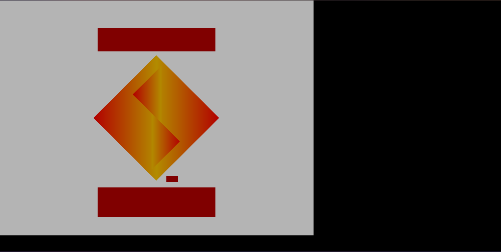

# pszigx

**WIP** PS1 Emulator in Zig

## Status

It boots!



## Usage

Obtain `scph1001.bin` through very legal means and put it in `assets`.

```bash
zig build run
```

## TODO

- Implement more GPU Rendering commands (Image Loads, Textures, etc)
- CDROM
- Timers
- Input
- Sound